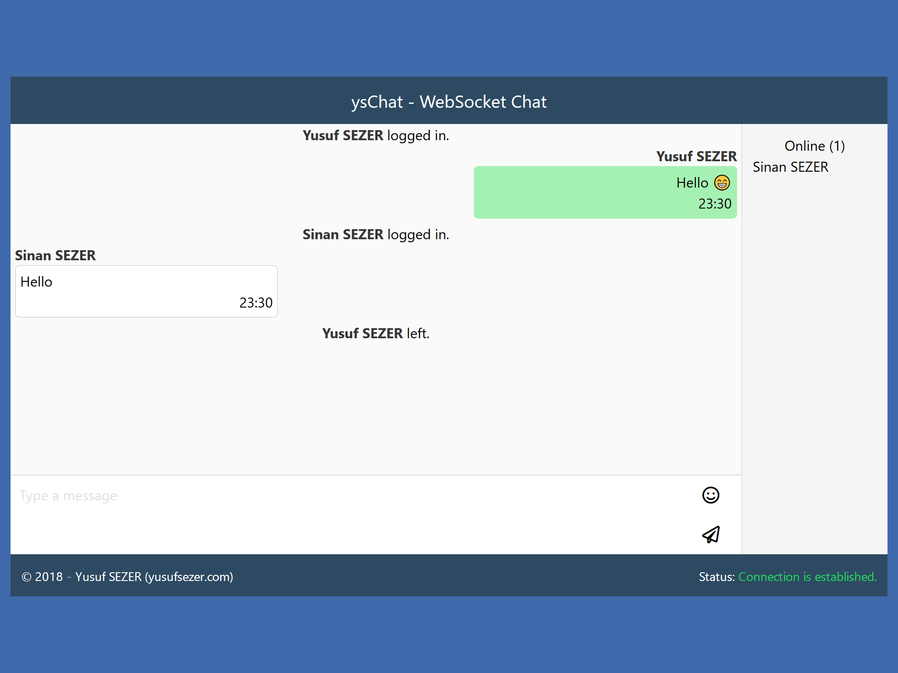

# ysChat

Web chat application developed with Express.js, Socket.IO and ReactJS, Bulma.

## How to Use

Make sure you have [Node.js](http://nodejs.org/) installed.

```sh
git clone https://github.com/yusufsefasezer/ysChat.git
cd ysChat
```

### Server

```sh
cd server
npm install
npm start
```

Your app should now be running on [localhost:1234](http://localhost:1234/).

### Client

```sh
cd client
npm install
npm start
```

Your app should now be running on [localhost:3000](http://localhost:3000/).

## Screenshot



# License
This project is licensed under the MIT License. See the [LICENSE](LICENSE) file for details

Created by [Yusuf Sezer](https://www.yusufsezer.com)
